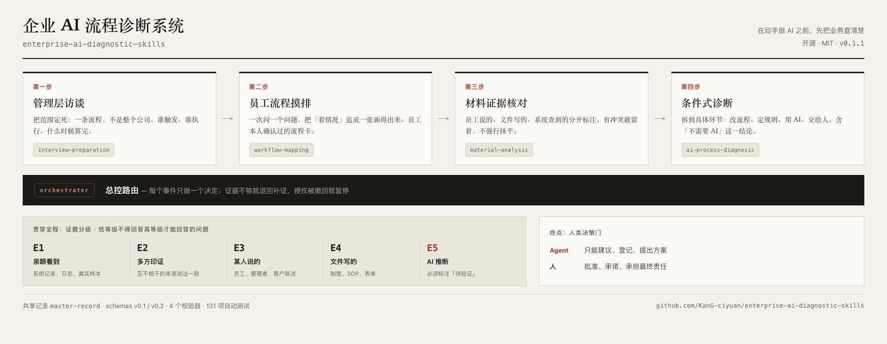

# Enterprise AI Diagnostic System

English | [简体中文](README.zh-CN.md)

[](https://github.com/KanG-ciyuan/enterprise-ai-diagnostic-skills/actions/workflows/local-checks.yml)
[](CHANGELOG.md)
[](#validation)
[](LICENSE)

**Understand how the business actually works before deciding what AI should automate.**

A working system for the step that most AI projects skip: establishing what a business process actually does, what the evidence supports, and where AI is — and is not — justified. Delivered as five agent Skill packages plus a shared record contract, with runnable routing and validation code.



---

## Contents

- [What this is](#what-this-is)
- [Why it exists](#why-it-exists)
- [Quick start](#quick-start)
- [How it works](#how-it-works)
- [What you get](#what-you-get)
- [The evidence model](#the-evidence-model)
- [Human / rule / agent boundary](#human--rule--agent-boundary)
- [Case studies](#case-studies)
- [Status and limits](#status-and-limits)
- [Validation](#validation)
- [Security and governance](#security-and-governance)
- [Repository layout](#repository-layout)
- [Contributing](#contributing)
- [License](#license)

---

## What this is

A diagnosis system for enterprise AI adoption, packaged as agent instructions.

It runs one bounded enterprise process end to end:

**management discovery → employee workflow mapping → authorized material analysis → evidence-gated diagnosis → shadow-pilot design → human decision gate.**

Five Skill packages carry the steps. A sixth module holds the shared record contract. The orchestrator routes between them. Evidence levels (`E1`–`E5`) run through all of it, and nothing advances on assertion alone.

It is built for transformation practitioners and enterprise project owners who must decide where AI is justified, where it is not, and where the process itself has to be fixed first.

> ### AI-generated coherence is not evidence.
>
> A fluent, well-structured diagnosis is the easiest artifact to produce and the hardest to verify. This system refuses to treat it as a finding. Every substantive claim must cite a material ID and a locator, carry an evidence level, and stay separable from model inference — which is labelled `E5`, stamped `AI假设，待验证`, and rejected by a validator when the label is missing.
>
> The same rule applies to this document. Where the repository has no evidence, this README says so.

---

## Why it exists

Two things go wrong before the model ever matters.

**The data is not ready.** Enterprise data is typically vague, duplicated, and inconsistent in its definitions. A better model fed unclear data returns unclear output. Real adoption usually requires cleaning dirty data into usable data first.

**The process is not understood.** Nobody can say precisely how a job is actually done. What the SOP describes and what people do are frequently different things, and the difference is where the project fails.

Neither problem is solved by choosing a better model. Together they are why AI gets connected and then sits unused.

The failure modes this system is designed against:

| Failure mode | Why it breaks the project | What this system does instead |
| --- | --- | --- |
| Scope is taken from the org chart, not from the work | The unit of analysis is a department, so there is no process with a trigger, an end state, or a decision | Bounded discovery slices by trigger, start, end and decision; a slice must be chosen before planning |
| Policy is read as practice | A SOP describes the intended rule. It does not describe what anyone actually does | SOPs are classified `E4`, which supports the intended rule only — never actual compliance or execution frequency |
| One loud account becomes an enterprise fact | A manager's summary is repeated until it reads like documentation | A single statement is `E3`: it supports what that person reports, not an enterprise-wide fact or a measured quantity |
| Conflicts are averaged away | Two incompatible accounts are reconciled by seniority or by whichever document looks more formal | Conflicts are preserved and typed; resolution requires new evidence, not a more official-looking file |
| The conclusion outruns the evidence | A route is recommended before demand, data, ownership and access are confirmed | Business value and technical readiness are judged separately; a component can be `阻塞` regardless of how real the need is |
| AI is chosen before the process is fixed | The automation encodes a broken handoff at machine speed | Responsibility allocation prefers process redesign and deterministic rules; `先改造原业务流程` and `不需要AI，采用普通数字化或自动化方案` are first-class conclusions |
| The model is asked to own the risk | A generated recommendation is treated as a decision | A named human role decides; the agent must stop at the gate rather than proceed |

For the contrast this method is built around — the pattern it is designed against versus evidence-gated diagnosis, across nine dimensions — see [Traditional vs Evidence-Gated Diagnosis](#traditional-vs-evidence-gated-diagnosis) below.

---

## Quick start

### Requirements

Python 3 with only the standard library. Nothing to install:

```bash
git clone https://github.com/KanG-ciyuan/enterprise-ai-diagnostic-skills.git
cd enterprise-ai-diagnostic-skills
./scripts/run_local_checks.sh
```

Expected output:

```
All local checks passed. Suites: 8, tests: 131.
```

That script runs the eight `unittest` suites and the provenance guard. CI calls the same script, so local and CI execution cannot drift.

### Running one Skill

Each package is self-contained. `SKILL.md` is the execution entry point; `references/`, `templates/`, `evals/` and `tests/` are part of the contract.

```
enterprise-interview-preparation/SKILL.md
enterprise-workflow-mapping/SKILL.md
enterprise-material-analysis/SKILL.md
enterprise-ai-process-diagnosis/SKILL.md
enterprise-ai-diagnostic-orchestrator/SKILL.md
```

Copy the **whole package directory** into the skill directory your agent platform reads. Copying a lone `SKILL.md` out of its package is not a supported use.

### Running the offline simulation

```bash
python3 enterprise-ai-diagnostic-orchestrator/scripts/run_offline_simulation.py \
  simulations/business-operations-crm-authorization/runtime-simulation/scenario.json \
  /tmp/diagnostic-run
```

Replays a fixed `E5`-only scenario through the router. It writes to a caller-provided directory, never to the master record, and connects to nothing.

### Validating records

```bash
cd enterprise-ai-diagnostic-master-record
python3 scripts/validate_master_record.py examples/retail-complaint-master-record.json
python3 scripts/validate_skill_handoff.py examples/skill-handoffs/workflow-mapping.json
python3 scripts/validate_handoff_chain.py \
  examples/retail-complaint-master-record-v0.2.json \
  examples/skill-handoffs/workflow-mapping.json \
  examples/skill-handoffs/material-analysis.json \
  examples/skill-handoffs/diagnosis.json
```

---

## How it works

Four steps, in this order. The order is the method — management discovery fixes the scope and authorizes the work; employee mapping reconstructs what actually happens; material analysis checks the claims; diagnosis comes last and proposes conditional options only.

| Step | Package | What it does | What it refuses to do |
| --- | --- | --- | --- |
| 1. Management discovery | `enterprise-interview-preparation` | Fix a single bounded process and the decision it must support; plan role coverage and evidence requests | Recommend technology |
| 2. Employee workflow mapping | `enterprise-workflow-mapping` | One question per turn until one job can be drawn and the employee confirms it | Diagnose, audit a department, or contact anyone |
| 3. Authorized material analysis | `enterprise-material-analysis` | Turn materials into an evidence ledger, claim-to-source map, conflict register and minimum evidence request | Select a technical route or estimate ROI |
| 4. Evidence-gated diagnosis | `enterprise-ai-process-diagnosis` | Assess demand, process defects and component feasibility; design a 3–7 day offline shadow pilot | Implement, write to production, or decide |

**The orchestrator routes; it does not decide.** Each event produces one routing decision and invokes at most one step. Insufficient evidence sends the work back for more evidence; a withdrawn authorization pauses it. It cannot approve, publish, notify, pay, or commit.

**The master record is a contract, not a Skill.** `enterprise-ai-diagnostic-master-record/` holds the shared schemas (`v0.1`, `v0.2`) and four validators, so every step reads and writes the same structure with the same evidence semantics.

### Traditional vs evidence-gated diagnosis

The left column describes the pattern this repository is designed against — it is the contrast the method is built around, not a measured survey of anyone's projects.

| | Traditional AI diagnosis | Evidence-gated diagnosis here |
| --- | --- | --- |
| Starting point | Org chart, stakeholder interviews, a preferred solution | One bounded process and the decision it must support |
| What counts as a fact | Whatever the most senior or most fluent source says | A claim with a source locator and an evidence level (`E1`–`E5`) |
| Official documents | Treated as proof of how work happens | `E4` — supports the intended rule, not execution |
| Model output | Presented as the analysis | `E5` — a lead to verify, labelled and machine-checked |
| Conflicts | Resolved by preference, seniority or formatting | Preserved and typed; only new evidence resolves them |
| Unreadable / missing material | Skipped silently | Recorded, plus a prioritized minimum evidence request naming the owner |
| Technical route | Selected up front, per project | Assessed per component as `可开发` / `有条件` / `阻塞` |
| Pilot | Promises a rollout | Offline shadow pilot design with pass / observe / stop criteria and rollback |
| Delivery authority | The deliverable recommends and the work proceeds | The agent proposes; a human role decides |

---

## What you get

Each deliverable below is defined by a template, schema, or code path that exists in this repository.

| Deliverable | Defined at | Nature |
| --- | --- | --- |
| **Interview plan** (`enterprise_interview_plan`) | [`enterprise-interview-preparation/templates/interview-plan.md`](enterprise-interview-preparation/templates/interview-plan.md) + JSON Schema | Template + schema, filled by a model following `SKILL.md` |
| **Employee workflow card** (employee-confirmed) | [`enterprise-workflow-mapping/templates/workflow-card.md`](enterprise-workflow-mapping/templates/workflow-card.md) + JSON Schema | Template + schema; requires explicit employee confirmation |
| **Evidence pack** | [`enterprise-material-analysis/templates/`](enterprise-material-analysis/templates/) | Evidence ledger, claim-to-source map, contradiction register, coverage gaps, minimum evidence request |
| **Internal diagnosis** | [`enterprise-ai-process-diagnosis/templates/conditional-technical-plan.md`](enterprise-ai-process-diagnosis/templates/conditional-technical-plan.md) | Demand verdict, process defects, per-component feasibility, conditional options |
| **System interface discovery card** | [`enterprise-ai-process-diagnosis/templates/system-interface-discovery-card.md`](enterprise-ai-process-diagnosis/templates/system-interface-discovery-card.md) | What is known about APIs, permissions, sandboxes and stable identifiers — and what is not |
| **3–7 day shadow pilot design** | [`enterprise-ai-process-diagnosis/references/diagnosis-framework.md`](enterprise-ai-process-diagnosis/references/diagnosis-framework.md) | Offline pilot with baseline, one exception, human takeover, pass / observe / stop criteria and rollback |
| **Management brief** | [`deliverables/management-diagnostic-report-v0.1/`](deliverables/management-diagnostic-report-v0.1/) | Client-facing view that preserves evidence level, `E5` labels and conflict status |
| **Master record** | [`enterprise-ai-diagnostic-master-record/schema/`](enterprise-ai-diagnostic-master-record/schema/) | Shared JSON record + validators, `v0.1` / `v0.2` |

---

## The evidence model

Every claim carries a level. The canonical definition is [`enterprise-material-analysis/references/evidence-model.md`](enterprise-material-analysis/references/evidence-model.md).

| Level | Source | Supports | Does not automatically support |
| --- | --- | --- | --- |
| `E1` | observed operation, system record, execution log, or representative real/desensitized sample | a process fact inside the observed item and period | all cases, causal explanations, employee intent, or ROI |
| `E2` | materially independent roles or sources corroborating the same concrete claim | a corroborated account | actual runtime execution unless one source is `E1` |
| `E3` | one employee, manager, customer, or supplier statement | what that person reports | enterprise-wide fact or measured quantity |
| `E4` | SOP, policy, form, specification, or intended flow | intended rule, design, or required process | actual compliance or execution frequency |
| `E5` | model inference or analyst hypothesis | a lead to verify | a fact, contradiction resolution, or external claim |

**The rule is one line:** a lower level may not answer a question that requires a higher one.

Two corollaries that are easy to get wrong:

- **A level comes from the source, not from confidence.** A person who asserts "the policy requires X" without producing the document is `E3`, not `E4`. Without the document there is no way to separate the rule from the recollection of it.
- **Unwritten rules stay `E3`.** A practice a role is expected to follow, which no document states, rests on one account. It is the most fragile class in the model: nothing in the record shows what was lost when the person left the role.

### It is enforced in code, not only in prose

- `master-record-v0.2.schema.json` constrains `evidenceLevel` to the enum `["E1","E2","E3","E4","E5"]`.
- [`validate_master_record.py`](enterprise-ai-diagnostic-master-record/scripts/validate_master_record.py) emits `E5_LABEL_MISSING` when an `E5` record does not carry the label `AI假设，待验证`.
- `tests/test_master_record.py` asserts that rejection; `tests/test_routing_contract_v02.py` raises `ValueError("E5 must remain visibly labelled")`.
- The offline simulation runner stamps `"evidence_level": "E5"` on every emitted record, and its test asserts it.

The routing contract states the operating rule directly: `E5` content must be marked `AI假设，待验证`, must not be mixed into `E1`/`E2` fact paragraphs or have its level stripped in management views, and a diagnosis may use `E5` to propose verification but may not form a settled conclusion from `E5` alone.

### Known gap: document provenance

The model has **no mechanism to establish that an uploaded file is an institutional document**. Anyone can upload a file that presents itself as a SOP. This is the document-side form of the rule that fluent output is not evidence: *a document that looks official is not thereby authoritative.*

A reusable primitive already exists in `enterprise_authorizations` — a named enterprise confirmer, a one-time capability, and a recorded confirmation with reason and time. Extending it to documents would require a named enterprise confirmer to attest the document's authority and effective scope. **Status: open.**

---

## Human / rule / agent boundary

Responsibility is allocated across five layers, and the boundary is the point of the system:

| Layer | Owns |
| --- | --- |
| Business process | roles, inputs, responsibility, handoff, exceptions |
| Deterministic rules | thresholds, required fields, permissions, time limits |
| Workflow | sequence, state, waiting, retry, escalation, recovery |
| AI | understanding, classification, extraction, summarisation, drafting |
| Agent | bounded dynamic choice inside explicitly granted permission |
| **Human** | **high-risk approval, money, customer commitments, final responsibility** |

Business rules identify. AI explains and suggests. The enterprise owns the goal, the rules and the trade-off.

Responsibility is separated across four further layers: capability boundary, enterprise organizational decision, implementer development, and post-launch maintenance. Components in a conditional technical plan are by default built or configured by the implementer's team or a vendor the enterprise names; enterprise employees provide authorized materials and take part in acceptance, and do not carry software development responsibility. **`可开发` means an offline prototype can be built. It does not mean people, budget, contracts or production access have been arranged.**

### Human decision gates

`A0`/`A1` may be settled inside the current conversation. `H1`, `H2` and `S0` require a bounded task or a stop. Closing `H2` requires an independent organizational confirmation record with the confirmer's authority basis, the interpretation adopted, scope, effective time, source evidence and affected records. An authorization withdrawal is not a note — it propagates: material → evidence pack → diagnosis → management view, each entering invalidated / recompute / publish-withdrawn state.

---

## Case studies

### A real-work retrospective (`E3`)

[`case-studies/real-process-retrospective.md`](case-studies/real-process-retrospective.md) — the method used on work the maintainer personally executed, desensitized. Also available as a [self-contained page](case-studies/real-process-retrospective.html).

What it contributed:

- **A scope error the method caught by itself.** Estimating volume showed the chosen work unit was the wrong one; the same operations ran under a second, far more frequent trigger.
- **Two inferences that were fluent, plausible and wrong.** They were caught only because they were labelled as inferences and checked line by line. This is the concrete form of *AI-generated coherence is not evidence*.
- **Three rules promoted into the evidence model**, including the verbal-rule-claim rule and the document-provenance gap above.
- **One insight deliberately withheld** for resting on a single case, recorded in [`CHANGELOG.md`](CHANGELOG.md) as identified but not adopted.
- **A limit the design missed.** A retrospective by someone who has left the role fails every corroboration path at once, so it stays `E3` permanently.

### Synthetic cases (`E5`)

Three complete end-to-end simulations, each running from employee mapping to a diagnosis conclusion:

- [`simulations/manufacturing-emergency-procurement/`](simulations/manufacturing-emergency-procurement/) — emergency procurement approval
- [`simulations/retail-complaint-refund/`](simulations/retail-complaint-refund/) — store complaint refund and compensation
- [`simulations/business-operations-crm-authorization/`](simulations/business-operations-crm-authorization/) — CRM customer ownership handover, 43 numbered files plus a runnable offline control fixture

Every enterprise identifier in these carries a `SIM` or `SYN` marker. They validate the mechanics; they are not evidence about any real company.

### The shadow pilot: designed, never executed

The 3–7 day pilot is a real design specification. **No real pilot has been run.** The only execution record is a synthetic, accelerated, single-session simulation.

---

## Status and limits

Declared status, taken from the files themselves:

| Field | Declared value |
| --- | --- |
| `manifest.json` `status` (all five packages) | `personal-experiment` |
| `manifest.json` `publication` (all five packages) | `local-only` |
| `manifest.json` `target_platforms` (all five packages) | `["codex"]` |
| `manifest.json` `maturity_tier` | `production-candidate` (four packages), `scaffold` (`enterprise-workflow-mapping`) |
| `SKILL.md` `metadata.maturity` | `personal-experiment` |
| Git tags | `v0.1.0`, `v0.1.1` — repository snapshots, not package releases |
| `CHANGELOG.md` | Present |
| GitHub Releases | None |

The badge above reads **Prototype**. `production-candidate` is the repository's own per-package tier label; it is a candidate tier, not a production claim, and it does not override `status: personal-experiment` or `publication: local-only`.

Even though every package declares `local-only` publication, the repository is public on GitHub under the MIT License. Maintainer metadata names **Kang Jiaxin** in the manifests, `SKILL.md` files and `agents/interface.yaml`; `LICENSE` names the copyright holder as **Kang**. The two are not unified here, and `LICENSE` has not been altered.

**What does not exist, stated plainly:**

- **No real enterprise deployment.** No real enterprise record exists anywhere in the tree.
- **No real client results.** No ROI, efficiency gain, cost saving, quality improvement, accuracy figure or adoption number has been measured, because no real engagement has taken place.
- **No independent or provider-backed validation.** The repository's own artifact records `"provider_backed": false`. A runtime case record states that independent runtime remains `missing evidence`.
- **No executed shadow pilot.** Only a synthetic, accelerated, single-session simulation exists. Nothing was connected to a production OA or CRM.
- **Not cross-platform.** All five manifests declare `"target_platforms": ["codex"]`.
- **Not a runtime system.** No database, unified entry point, task queue, scheduler or web service. The executable logic is a deterministic router, an offline simulation runner, four validators and the root provenance guard.
- **Not a substitute for the people.** It does not interview employees autonomously, contact anyone, send messages, modify business systems, or make commitments.

---

## Validation

### What was actually run

Eight `unittest` suites plus a provenance guard, all executed from the repository root with the Python standard library. **131 tests, all passing.**

```bash
python3 -m unittest discover -s enterprise-interview-preparation/tests          # 9 tests,  OK
python3 -m unittest discover -s enterprise-workflow-mapping/tests               # 7 tests,  OK
python3 -m unittest discover -s enterprise-material-analysis/tests              # 7 tests,  OK
python3 -m unittest discover -s enterprise-ai-process-diagnosis/tests           # 7 tests,  OK
python3 -m unittest discover -s enterprise-ai-diagnostic-orchestrator/tests     # 23 tests, OK
python3 -m unittest discover -s enterprise-ai-diagnostic-master-record/tests    # 56 tests, OK
python3 -m unittest discover -s simulations/business-operations-crm-authorization/tests  # 17 tests, OK
python3 -m unittest discover -s deliverables/management-diagnostic-report-v0.1/tests     # 5 tests,  OK
python3 scripts/validate_personal_skill_ownership.py                            # personal_skill_ownership_valid
```

[`scripts/run_local_checks.sh`](scripts/run_local_checks.sh) runs all eight suites and the guard in one command and exits non-zero on any failure. [`.github/workflows/local-checks.yml`](.github/workflows/local-checks.yml) calls that same script on every push and pull request, so local and CI execution cannot drift.

### What the tests do and do not prove

They genuinely exercise the mechanics. The router is driven by 13 tests asserting decision, target and reason codes for cross-enterprise input, authorization withdrawal, unknown source, premature diagnosis and non-owner recovery, plus an anti-drift test that re-runs the router and field-compares against all six saved outputs. The master-record validator is exercised with deliberate mutation cases. The offline runner is executed end to end. The committed XLSX is opened as a real ZIP and its seven sheet names are asserted.

They do **not** validate the method. The large majority of the 131 tests are string-containment assertions on Markdown — they pass if a sentence is present and fail if it is reworded. **Nothing in this repository tests an actual model.** The trigger evaluation is a keyword-concept scorer over recorded prompts, not an activation test and not model-scored evaluation. Every test here validates the repository against itself, never efficacy against a real enterprise.

Two internal cross-references were known to be broken; the dangling design-document reference was resolved in `v0.1.1` and the day-count inconsistency corrected. `outputs/crm-shadow-pilot-20260816/crm-shadow-pilot-result.xlsx` is a committed XLSX with seven named sheets for which **no generating script exists in this repository** — its declared result fingerprint cannot be recomputed from the tree.

### Evidence the repository's own tooling recorded as failing

Both committed local release checks — `enterprise-material-analysis/reports/local-release-check.json` and `enterprise-ai-process-diagnosis/reports/local-release-check.json` — report `"ok": false` with `{"pass": 3, "warn": 3, "block": 3}`. The blocked gates are `package_validation`, `git_diff_check` and `feature_branch`; the warnings are `clean_worktree`, `clean_install` and `provider_or_human_output_evidence`. The provider-or-human output evidence gate is the one that matters most, and the reason is recorded next to it.

### Evidence classification for this README

| Claim | Class |
| --- | --- |
| The router, the offline simulator and the four validators execute and produce the outputs shown | `VERIFIED` |
| 131 tests across eight suites pass, in CI, on a bare interpreter | `VERIFIED` |
| The `E1`–`E5` model exists and is enforced in schema, validator and tests | `VERIFIED` |
| Governance rules are substantive and partly machine-enforced | `VERIFIED` |
| The CRM case study, both smaller simulations, the master-record examples and every deliverable's content | `SIMULATED` (`E5`) |
| The real-work retrospective | `E3` — single-person recollection, desensitized |
| The 3–7 day shadow pilot as an executed run | **not claimed** — design only |
| Real enterprise results, ROI, pilot outcomes, independent provider validation | `TO_VERIFY` — and the repository's own artifacts say they do not exist yet |

---

## Security and governance

**Data scope.** Only enterprise materials the user has explicitly authorized and placed in scope are processed. Real API keys, tokens, cookies or credential files are never recorded in the repository, replies, documents or logs. `.env` files, key files, raw personal information and undesensitized enterprise data are not committed. No API key, token, cookie, password, private key or credential value is present anywhere in the tracked tree.

**Privacy in reusable artifacts.** Use project codes and anonymous identifiers in portable artifacts. Do not place customer names, employee identities, credentials, raw private transcripts or sensitive business content in reusable Skill files or public fixtures. Originals stay unchanged; unreadable, truncated, image-only, password-protected or corrupted files are recorded rather than guessed at. Do not silently scan unrelated chats, files, logs, accounts or knowledge bases.

**Authorization withdrawal.** When authorization is withdrawn, the upstream material and everything derived from it must enter review state and may not continue to be used externally. This is enforced in code, in the validator, and in tests: the router requires `H2` human review on withdrawal, and `test_withdrawn_material_propagates_through_evidence_pack_to_diagnosis` proves the propagation. Output views must use `metadata_policy: preserve_source_metadata` — a view may filter content but may not strip evidence level, `E5` label, conflict status, authorization status or version lineage.

**Anti-overclaim rules.** Do not claim efficiency, cost, quality, integration readiness or business improvement without the required evidence. Client communication must not hide a material risk or evidence gap, turn an assumption into a confirmed fact, or promise ROI, accuracy, delivery or compliance without evidence.

**Attribution guard.** [`scripts/validate_personal_skill_ownership.py`](scripts/validate_personal_skill_ownership.py) walks every text file in the five package directories and fails if a package does not declare `owner: Kang Jiaxin`, if a forbidden attribution marker appears, if an external URL other than the JSON Schema dialect URI is present, or if a package declares an `upstream_inspiration`. It is a real provenance guard, and it is the reason former attribution names appear in this repository only as forbidden-marker constants inside the guard itself. Its scope is limited to the five package directories: it does not scan the root `README.md`, `docs/`, `simulations/`, `deliverables/`, `outputs/`, `scripts/` or `enterprise-ai-diagnostic-master-record/`, so the URL-bearing prior-art research reports outside those directories are not covered by it.

**Enforcement limits.** What is machine-enforced covers the JSON record layer and the routing layer. The Markdown outputs are constrained by instruction only — there is no validator for them, and nothing here tests whether a model actually obeys `SKILL.md`.

---

## Repository layout

```text
.
├── assets/                                 # architecture diagram + its HTML source
├── enterprise-interview-preparation/       # Skill 1 - management discovery
├── enterprise-workflow-mapping/            # Skill 2 - employee workflow card
├── enterprise-material-analysis/           # Skill 3 - evidence pack
├── enterprise-ai-process-diagnosis/        # Skill 4 - diagnosis + shadow pilot
├── enterprise-ai-diagnostic-orchestrator/  # Skill 5 - router (runnable code)
├── enterprise-ai-diagnostic-master-record/ # shared record contract (not a Skill)
├── simulations/                            # synthetic end-to-end cases (E5)
├── case-studies/                           # records of the method used on real work
├── portfolio/                              # reader-facing project introduction
├── deliverables/                           # static report and proposal artifacts
├── outputs/                                # one committed XLSX artifact, no generator
├── docs/                                   # offline runtime design notes and plans
├── scripts/                                # local check runner + provenance guard
├── CHANGELOG.md
├── README.md / README.zh-CN.md
└── LICENSE
```

Each package carries its own `references/`, `templates/`, `evals/`, `reports/` and `tests/`.

---

## Contributing

Issues and pull requests are welcome, with one requirement: **claims in a contribution must carry the same evidence standard the repository applies to itself.** Say what was run, on what, and what could not be verified.

Before opening a pull request:

```bash
./scripts/run_local_checks.sh
```

It must exit zero. If you change a `SKILL.md`, a template or a schema, update the matching tests in the same change — the suites assert on the text those files contain.

---

## License

Released under the [MIT License](LICENSE).

Copyright (c) Kang.
