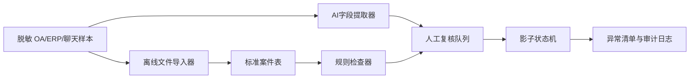

# 企业 AI 应用诊断：紧急采购（模拟验证）

## 1. 结论

| 判断 | 结果 |
|---|---|
| 业务首要结论 | **先改造原业务流程** |
| 业务置信度 | **中**：入口、交接和异常确有多角色陈述及制度支持，但发生量与根因未验证 |
| 技术成熟度 | **可进入离线影子验证** |
| 生产集成成熟度 | **补齐系统条件后可设计集成**：接口可用性未知 |

问题不是“需不需要 Agent”，而是紧急采购缺少经确认的统一入口、稳定案件标识、共同状态、交接验收和例外时限。第一阶段先验证统一案件和异常发现是否有用，再决定连接 OA/ERP 的方式。

## 2. 证据边界

支持业务诊断的主要证据：C-001 至 C-008、C-010、C-012、C-013。当前冲突：X-001 至 X-005。

- 制度要求特殊情况 **1 个工作日**内补齐 OA（C-002）；采购经理口述应**当天补 OA**（C-003）。不能由实施方替企业合并成一个时限。
- 仓库报告存在不可见异常（C-007/C-008），但无法确认是同步、权限、编码还是未提交（X-002/X-004）。
- 单量、工时和异常次数主要为估计（C-009/C-014），不能计算 ROI 或宣称改善。
- MAT-006 不可读，不进入根因判断。

继承证据包的禁止结论：不能说所有紧急采购都从 OA 开始、ERP 建单后仓库一定可见、主持人的目标已实现，或当前材料足以计算效率提升。

## 3. 责任分配

| 能力 | 负责什么 | 当前判断 |
|---|---|---|
| 业务流程 | 统一案件标识、正式补批时限、状态责任人、仓库交接验收 | 先由跨部门流程负责人确认 |
| 确定性规则 | 必填、报价数量、批准完整性、超时、状态转换 | 可在离线样本中验证 |
| 工作流 | 案件状态、等待、退回、升级、人工接管 | 先做影子状态机 |
| AI工作流 | 从聊天/附件提取字段和来源片段，草拟缺件与异常摘要 | 可离线验证，结果必须复核 |
| API/文件/RPA | 读取 OA/ERP 记录 | 有条件，取决于系统发现卡 |
| 有界 Agent | 动态选择查询或追问动作 | 第一轮不需要；固定流程足以验证核心假设 |
| 人工 | 时限定稿、规格、供应商选择、正式批准、付款放行 | 不自动化 |

## 4. 系统与接口发现卡

| 系统 | 接入方式 | 认证/权限 | 测试环境 | 数据字段与标识 | 状态 |
|---|---|---|---|---|---|
| OA | 未知 | 未知 | 未知 | 证据请求需要申请ID、创建/批准/补齐时间 | 未知 |
| ERP | 仅有一行脱敏 CSV 样本；API/导出机制未知 | 未知 | 未知 | 当前可见 `order_id`、创建时间和状态；跨系统标识未知 | 仅口述/样本有限 |
| 企业聊天 | 只有会议和流程卡摘录；导出授权未知 | 未知 | 不适用/未知 | 首发时间、申请人、附件与案件标识待确认 | 未知 |
| 仓库查询端 | 只知道员工称曾查不到 | 未知 | 未知 | 查询时间、订单号、可见状态待补 | 仅口述 |

结论：不得因为存在 OA 和 ERP 就推定存在 API。现阶段不具备承诺生产集成的证据，但可用授权的脱敏文件做离线影子验证。

## 5. 条件式技术方案

### 组件与可开发状态

| 组件 | 作用与主要输入输出 | 状态 | 条件或边界 |
|---|---|---|---|
| 离线文件导入器 | 读取授权 CSV/表格；输出统一记录 | 可开发 | 第一轮只读本地脱敏样本，坏行隔离 |
| 标准案件表 | 用 `case_id` 关联聊天、OA、ERP与仓库时间 | 有条件 | 企业尚未确认跨系统稳定标识；试点可用模拟映射表 |
| 规则检查器 | 检查必填、批准、超时与状态转换 | 有条件 | “当天”或“1个工作日”必须由流程负责人定稿 |
| AI字段提取器 | 从文字提取申请字段、来源片段、置信度 | 可开发 | 只生成候选 JSON，不决定供应商或批准 |
| 人工复核队列 | 对低置信度、冲突、高风险缺件确认 | 可开发 | 每项保留证据定位和操作人 |
| 影子状态机 | 展示当前状态、下一责任人、异常与超时 | 有条件 | 状态名称和责任人需跨部门确认 |
| 审计日志 | 记录输入版本、规则版本、模型结果、人工修改 | 可开发 | 不写真实密钥和敏感原文 |
| OA/ERP连接器 | 生产环境读取或写回 | 阻塞 | 接口、权限、认证、测试环境、安全审批均未知 |

### 建议的案件字段（草案）

`case_id`、`source_record_id`、`chat_first_at`、`oa_created_at`、`oa_approved_at`、`oa_completed_at`、`supplier_code_status`、`erp_order_created_at`、`erp_order_submitted_at`、`warehouse_query_at`、`arrival_at`、`current_state`、`exception_type`、`evidence_ref`、`human_review_status`。

字段只是待验证的数据契约，不代表现有系统已经具备。

### 接入条件分支

| 条件 | 后续路线 | 控制 |
|---|---|---|
| 官方 API/Webhook 可用 | 先做只读连接器，再单独审批写回 | 最小权限、限流、重试、幂等、沙箱与审计 |
| 只有稳定导出 | 定时或人工导出后批量导入 | 文件版本、`case_id` 去重、坏行隔离、可重放 |
| 无接口但授权稳定 UI | 仅在必要时采用 RPA 读取 | 页面变更监测、截图、有限重试、人工接管、维护负责人 |
| 无任何系统访问 | 继续人工观察表和离线样本 | 不宣称集成、不影响原流程 |

## 6. 状态与异常草案

`已接收 → 待正式申请 → 待材料校验 → 待批准 → 待ERP建单 → 待仓库确认 → 已关闭`，任一节点可进入 `异常待人工处理`。

- 幂等键：优先使用企业确认的 `case_id`；未确认前不自动合并记录。
- 重复：相同来源ID进入待人工合并，不覆盖旧记录。
- 超时：只按企业确认后的时限计算；X-005 未解决前同时展示两种口径，不自动升级。
- AI失败：无有效 JSON、缺来源片段或低置信度时进入人工复核。
- 停机：关闭影子处理后，原 OA、ERP 和人工交接继续运行。

## 7. 五天离线影子试点

| 天 | 实际构建与验证 | 产物 | 当日停止条件 |
|---|---|---|---|
| 1 | 收集20笔脱敏记录；确认字段字典、案件映射与人工基准 | 样本包、字段字典、冲突清单 | 无授权样本或无法建立任何案件关联 |
| 2 | 构建离线文件导入器、标准案件表和规则检查器 | 可重复运行的导入结果、规则命中日志 | 关键字段大面积缺失且无补证路径 |
| 3 | 构建AI字段提取器和人工复核队列；逐项保留来源片段 | AI/人工对照表、低置信度队列 | 高风险字段无来源仍被自动接受 |
| 4 | 配置影子状态机，演练仓库不可见、编码待处理、补批超时 | 异常路径记录、人工接管记录 | 异常不能进入明确负责人或无法回退 |
| 5 | 比较人工基准与影子结果；评估接口分支和继续条件 | 误报漏报、人工时间实测、继续/调整/停止建议 | 不能形成可审计证据或企业不确认规则负责人 |

通过只代表“值得进入下一阶段接口验证”，不代表生产可上线。生产路线必须在系统负责人、安全负责人和业务负责人补齐接口、权限、部署、数据与维护证据后重新审查。

## 8. 下一决策门

| 最小证据 | 负责人 | 会改变什么 |
|---|---|---|
| 20笔跨系统时间链 | OA/ERP管理员+采购 | 验证入口、等待与案件映射 |
| 两笔仓库异常的事件链 | ERP管理员+仓库 | 区分同步、权限、编码或未提交 |
| 补批正式时限定稿 | 跨部门流程负责人 | 固化规则检查与超时升级 |
| API/导出/UI能力和沙箱 | 系统负责人/供应商 | 在 API、文件、RPA 或人工观察间选路 |
| 数据分类、部署和模型使用边界 | 安全负责人 | 决定 AI 可处理的字段和运行位置 |

