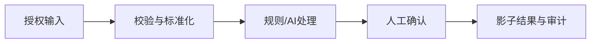

# 条件式技术方案

## 1. 事实前提与禁止推断

- 支持方案的证据ID：
- 冲突和未知：
- 继承的禁止结论：
- 本方案不是事实的假设：

## 2. 总体可行性

- 业务结论：
- 技术成熟度：
- 当前可验证范围：
- 当前不可开发或不可承诺范围：

## 3. 逻辑架构与数据流

| 组件 | 流程节点与职责 | 输入/输出字段 | 可行性 | 维护负责人 |
|---|---|---|---|---|
|  |  |  | 可开发/有条件/阻塞 |  |

## 4. 条件分支

| 条件 | 技术路线 | 读写权限 | 异常与回退 | 是否进入本轮 |
|---|---|---|---|---|
| 官方 API/Webhook 已确认 | API连接器+工作流 | 先读后写，分别审批 | 限流、重试、幂等、人工接管 |  |
| 仅支持稳定导入导出 | 文件批处理/影子模式 | 授权目录内读写 | 去重、隔离、重放、人工对账 |  |
| 无接口但授权稳定 UI | RPA适配器 | 默认只读 | 超时、截图、有限重试、人工接管 |  |
| 只能人工观察 | 离线观察与原型 | 不接生产系统 | 双人抽查、保留原流程 |  |

## 5. 状态、异常与控制

- 状态与转换：
- 唯一标识和幂等键：
- 校验、重复、乱序与超时：
- 重试上限和失败队列：
- 人工确认与接管点：
- 审计日志、证据定位和保留期限：
- 告警、停机开关和恢复：

## 6. AI / Agent 边界

- AI任务、结构化输出、来源片段和置信度：
- 必须由确定性规则校验的字段：
- 必须人工确认的决定：
- Agent若被采用，其工具白名单、权限、预算/时间限制、停止规则和后备路径：

## 7. 3-7天验证与验收

| 天 | 构建或验证活动 | 产物 | 验收 / 停止条件 |
|---|---|---|---|
| 1 |  |  |  |

## 8. 开放问题与下一决策门

| 问题 | 负责人 | 最小证据 | 证据如何改变方案 |
|---|---|---|---|
|  |  |  |  |

