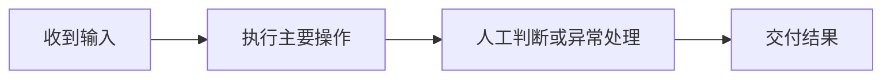

# 岗位工作流程确认卡

## 基本信息

| 项目 | 内容 |
|---|---|
| 项目代号 |  |
| 员工编号 |  |
| 部门 / 岗位 |  |
| 本次工作 |  |
| 触发条件 / 频率 |  |
| 结果使用者 |  |
| 确认状态 / 版本 |  |

## 工作流程

| 步骤 | 谁来做 | 输入与来源 | 实际操作 | 系统或材料 | 输出与去向 | 判断依据 | 异常怎么办 | 证据状态 |
|---|---|---|---|---|---|---|---|---|

## 工作负担

| 频率 | 常规/峰值数量 | 实际操作时间 | 等待时间 | 返工 | 出错影响 | 证据状态 |
|---|---|---|---|---|---|---|

## 材料与证据

| 编号 | 安全标签 | 支持内容 | 证据等级 |
|---|---|---|---|

## 待确认事项

- 

## 员工确认

- 我已检查这份流程卡，它是否正确描述了这项工作：`是 / 否`
- 需要修改的内容：
- 确认时间：

> 本卡仅用于还原工作事实，不包含数字化改造、AI、RPA或Agent建议。

