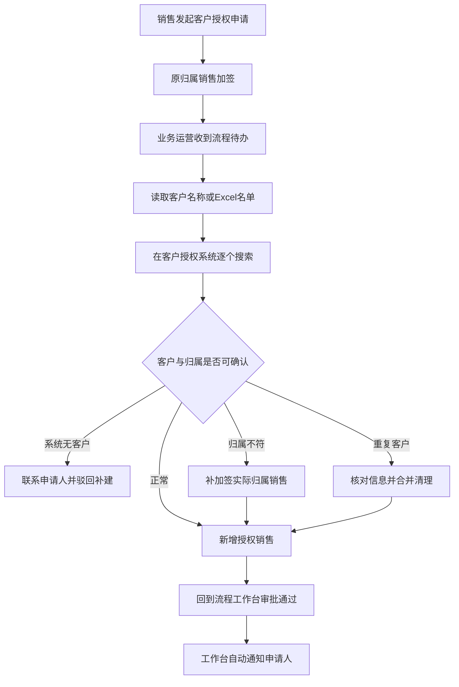

# 岗位工作流程确认卡：CRM客户访问授权

## 基本信息

| 项目 | 内容 |
|---|---|
| 部门 / 岗位 | 业务运营 |
| 本次工作 | CRM客户访问授权 |
| 触发条件 | 内部流程完成原归属销售加签，待办到达业务运营 |
| 频率 | 普通每天约6至7个授权流程；每个流程包含1个或多个客户 |
| 结果使用者 | 授权申请销售 |
| 确认状态 / 版本 | 员工本人确认 / v1 |
| 确认时间 | 2026-08-15T19:15:16+08:00 |

## 工作流程

| 步骤 | 谁来做 | 输入与来源 | 实际操作 | 系统或材料 | 输出与去向 | 判断依据 | 异常怎么办 | 证据状态 |
|---|---|---|---|---|---|---|---|---|
| 1 | 销售申请人 | 客户授权需求 | 发起授权流程，填写客户名称、新销售所属部门和授权类型 | 内部流程工作台 | 加签任务 | 申请需求 | 信息缺失时需补充 | E3员工陈述 |
| 2 | 原归属销售 | 授权申请 | 审批是否同意新增授权销售 | 内部流程工作台 | 业务运营待办 | 当前客户归属关系 | 归属不一致时由业务运营补加签实际归属销售 | E3员工陈述 |
| 3 | 业务运营 | 流程待办、客户名称或Excel名单 | 打开审批页面，读取客户信息 | 内部流程工作台 | 待搜索客户清单 | 审批已到达本人待办 | Excel批量任务逐行处理 | E3员工陈述 |
| 4 | 业务运营 | 客户名称 | 复制客户名称，在客户授权系统逐个搜索并核对归属销售 | 客户授权系统 | 客户记录与归属信息 | 客户名称、当前跟进销售和所属部门 | 搜不到、归属不符或重复客户时进入异常分支 | E3员工陈述 |
| 5 | 业务运营 | 可确认的客户记录、已通过的加签 | 为客户新增需要授权的销售 | 客户授权系统 | 新销售获得客户访问权限 | 加签结果与实际归属一致 | 授权前必须先处理未闭环异常 | E3员工陈述 |
| 6 | 业务运营 | 已完成的授权结果 | 回到流程工作台点击审批通过 | 内部流程工作台 | 流程结束并通知申请人 | 必须先完成客户授权 | 未完成授权不得点击通过 | E3员工陈述 |

## 异常处理

| 情况 | 实际处理 | 判断或权限 |
|---|---|---|
| 系统中没有客户 | 联系销售说明情况，驳回流程，由销售先创建客户 | 业务运营确认系统无对应客户 |
| 客户不在已加签销售名下 | 补加签给实际归属销售，审批同意后再授权 | 以客户授权系统中的当前归属记录为准 |
| 多个相似或重复客户 | 核对客户名称、统一社会信用代码、联系人手机号、地址和历史更新记录；关联、合并并删除错误记录后再授权 | 业务运营有直接操作权限，要求合理操作并留痕 |

系统自动记录操作人、操作时间、合并前后记录和授权对象。

## 工作负担

| 频率 | 常规/峰值数量 | 实际操作时间 | 等待时间 | 返工与完整性检查 | 证据状态 |
|---|---|---|---|---|---|
| 普通每天约6至7个授权流程 | 每个流程1个或多个客户 | 顺利时每个客户约1分钟 | 加签和异常处理时间未统计 | 批量任务逐行标记、改变Excel颜色并另外记录结果 | E3员工估计 |
| 销售离职批量交接 | 每次至少30个客户起步 | 随客户数量增加，只能逐个搜索、核对和授权 | 归属确认和补加签会产生等待 | 当前无批量导入或批量授权入口 | E3员工估计 |

## 材料与证据

本轮没有上传真实OA记录、Excel名单、系统截图或操作日志。以上内容均为员工本人陈述（E3）。员工提到系统具备操作日志，后续可在授权范围内抽样核验，但本卡不把未查看的日志写成已验证事实。

## 待确认事项

- 普通与峰值客户数量、实际耗时和异常比例尚未通过系统日志核验。
- 尚未核验客户授权系统是否存在未被当前员工使用的批量能力或接口。
- 客户合并与删除的正式制度、复核要求和审计规则尚未提供材料。

## 员工确认

- 员工已检查并确认本卡正确描述该项工作：是
- 确认时间：2026-08-15T19:15:16+08:00
- 版本：v1

> 本卡仅用于还原工作事实，不包含数字化改造、AI、RPA或Agent建议。
