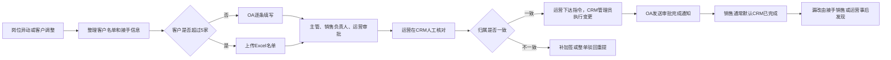

# 销售申请人工作流程卡 v2（模拟确认版）

> 证据等级：E5 AI/用户角色扮演模拟，待真实销售员工验证。
>
> 本卡只用于测试员工摸排 Skill 的追问、修订和确认能力；不得登记为真实员工 E3 口述，不得关闭销售 P0 覆盖缺口，不得据此开放诊断门。

## 流程身份

- 流程：CRM 客户授权与岗位异动交接
- 模拟角色：销售申请人
- 触发：岗位异动或客户调整
- 状态：模拟对话内已确认；企业事实未确认

## 当前流程

## 输入与操作

- 输入：客户名单、CRM 当前归属人、接手销售、近期跟进状态、风险和待办。
- 5 家以内在 OA 逐条填写；超过 5 家上传 Excel。
- Excel 包含客户全称、CRM 客户编号、跟进状态和风险待办；客户编号经常漏填。
- OA 不解析 Excel，也不连接 CRM 校验客户存在性、重复记录或真实归属。
- 审批链：销售申请人、直属主管、销售负责人、业务运营负责人。
- 销售负责人偶尔能在审批途中发现名单错误并驳回。
- 运营负责核对和裁决，CRM 管理员负责实际修改 CRM 数据。

## 异常与风险

- 归属不一致时人工补加签，或整单驳回重新发起。
- OA 审批闭环与 CRM 实际变更存在时间差。
- 销售只收到 OA 审批完成通知，普通客户通常不逐条验收。
- 漏改一般由接手销售或运营后续发现。
- 模拟陈述中的返工基线：部门每月约 2 至 3 次；17 个客户案例额外增加 3 个工作日。该数据待真实台账核验。

## 待真实员工与材料验证

- Excel 模板实际字段及 CRM 客户编号缺失率。
- OA 审批链和各节点退回记录。
- OA 完成时间与 CRM 变更日志的时间差。
- 每月返工频次、客户数量和额外耗时。
- CRM 管理员是否支持真正的批量修改及失败回执。
