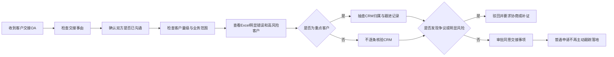

# 销售负责人工作流程卡（模拟确认版）

> 证据等级：E5 AI/用户角色扮演模拟，待真实销售负责人验证。
>
> 本卡只用于测试跨岗位摸排、责任冲突识别和确认能力；不得关闭真实岗位覆盖缺口，不得据此开放诊断门。

## 流程身份

- 流程：CRM 客户授权与岗位异动交接审批
- 模拟角色：销售负责人
- 状态：模拟对话内已确认；企业事实未确认

## 当前流程

## 审批与责任边界

- 审批重点是交接事由、人员安排、双方共识和业务范围。
- 普通客户不逐条核验 CRM；高价值客户才进行抽查。
- 审批通过只代表同意交接事项，不代表名单逐条准确。
- 申请销售是名单准确性的第一责任人。
- 销售负责人知情放行时承担管理责任。
- 运营负责后置核验、退回和裁决。
- OA 只有同意和驳回，未区分业务批准与数据核验。
- 申请销售没有名单准确性责任确认，当前责任边界缺少系统留痕。
- 常规审批放行后不再主动跟踪交接落地；仅高风险、大客户或出现纠纷时再次介入。

## 待组织确认

- 申请人、销售负责人和业务运营分别承担哪些书面责任。
- OA 是否需要区分业务批准、名单确认和执行验收。
- 返工与超时如何记录责任，不由 Agent 自行裁决。
