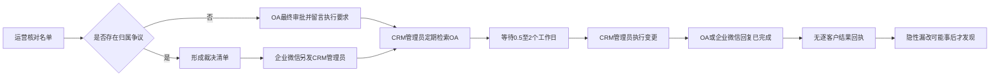

# 业务运营负责人审批执行交接卡（模拟确认版）

> 证据等级：E5 AI/用户角色扮演模拟，待真实业务运营负责人和系统记录验证。
>
> 本卡不得替代真实管理层确认，不得关闭证据缺口或开放诊断门。

## 当前流程

## 交接事实

- 常规任务通过原 OA 审批单和评论区下达执行要求。
- 争议裁决任务通过企业微信额外发送裁决 Excel。
- CRM 管理员没有自动待办或超时提醒，通常每天上、下午各检索一次。
- 从运营审批到管理员开始处理，常见等待 0.5 至 2 个工作日，极端漏检可达 3 个工作日。
- 管理员通常只回复已完成，不提供逐客户成功、失败和遗漏结果。
- 申请人只能看到 OA 审批结束，无法确认 CRM 是否实际更新完成。

## 版本风险

- 争议场景下，企业微信发送的裁决 Excel 是唯一有效执行版本，应取代 OA 原始附件。
- OA 旧附件不会被替换或标记作废。
- CRM 管理员需要靠人工记忆和消息备注判断有效版本。
- 管理员误用 OA 原始名单时，可能使裁决未落地并再次造成归属错误。

## 待验证

- OA 检索方式、实际等待时长和漏检记录。
- 企业微信裁决文件与 OA 原附件的版本关系。
- CRM 管理员执行日志、失败记录和完成回执。
