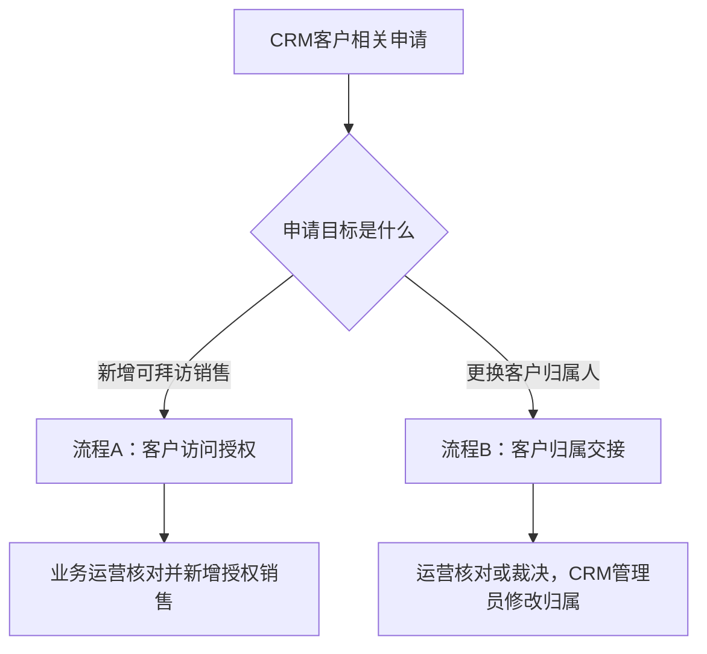

# CRM 客户授权跨岗位材料分析 v1

> 分析状态：模拟材料分析。
>
> 证据边界：业务运营流程卡为 E3 员工本人陈述；销售申请人、销售负责人、业务运营负责人和 CRM 管理员卡均为 E5 角色扮演模拟。不得把 E5 内容写成企业事实。

## 核心发现

当前材料实际上包含两个名称相近、但结果和责任人不同的流程，不能直接合并为一条流程。

## 两个流程的边界

| 维度 | 流程A：客户访问授权 | 流程B：客户归属交接 |
|---|---|---|
| 业务结果 | 在现有客户下新增可拜访销售 | 将客户主归属从原销售转给接手销售 |
| 典型触发 | 销售申请访问或共同管理客户 | 离职、岗位异动、客户调整 |
| 执行岗位 | 业务运营直接操作客户授权系统 | 模拟材料称 CRM 管理员修改归属 |
| 关键风险 | 加错销售、漏授权、重复客户 | 错配、漏分配、重复分配、旧版本执行 |
| 批量能力 | E3 员工称当前只能逐个搜索和授权 | E5 模拟称有客户编号时可批量导入 |
| 当前证据 | E3 员工确认流程卡 | E5 多角色模拟卡，待真实验证 |

## 不可直接相信的合并结论

1. **执行岗位冲突**：业务运营真实流程卡称由业务运营直接操作；模拟交接流程称由 CRM 管理员执行。两者可能分别对应访问授权和主归属变更，不能选一个覆盖另一个。
2. **批量能力冲突**：E3 流程卡称没有当前员工可用的批量授权入口；E5 模拟称归属变更支持带客户编号的批量导入。两者可能是不同功能，不得据此断言 CRM 整体有或没有批量能力。
3. **审批完成含义不同**：访问授权流程中，业务运营操作完成后才点击流程通过；归属交接模拟中，OA 审批完成后 CRM 管理员可能尚未执行。两种状态不能共用同一个“已完成”定义。
4. **指标口径可能混用**：归属错误率、争议时长和批量交接耗时属于主归属交接；日常 6 至 7 个授权流程和单客户约 1 分钟属于访问授权。不得把两个流程的数据合并计算效率或 ROI。

## 跨岗位一致风险（仍待真实证据）

- OA 与 CRM 缺少数据校验和状态联动。
- Excel 客户编号缺失会增加人工搜索和错误匹配风险。
- 审批完成、实际执行完成和员工验收之间缺少统一状态。
- 执行结果缺少逐客户成功、失败和遗漏回执。
- 争议裁决清单与 OA 原附件可能形成版本冲突。
- 责任边界、返工责任和超时责任缺少系统化留痕。

## 最小补证请求

| 优先级 | 需要确认的内容 | 建议责任角色 | 最小材料 |
|---|---|---|---|
| P0 | 是否正式拆分“访问授权”和“归属交接” | 业务运营负责人 | 两类申请的制度或流程名称、适用范围 |
| P0 | 归属交接真实执行岗位与审批链 | 真实销售申请人、销售负责人、运营负责人 | 一份脱敏交接 OA 和流程轨迹 |
| P0 | 归属变更批量能力与失败回执 | 真实 CRM 管理员 | 导入模板、操作截图、错误样本 |
| P1 | 访问授权是否确无批量入口 | 业务运营、CRM 管理员 | 授权页面和权限说明 |
| P1 | OA 完成与 CRM 执行的时间差 | 运营、CRM 管理员 | 同一单据的 OA 时间与 CRM 日志时间 |

## 禁止结论

- 不得把模拟角色卡升级为真实岗位口述。
- 不得把两个流程合并后直接设计自动化或 Agent。
- 不得断言 CRM 整体不支持批量操作。
- 不得断言所有客户变更都由 CRM 管理员执行。
- 不得使用模拟指标计算真实收益、错误率或 ROI。
- 在负责人确认流程边界、P0 真实岗位覆盖和系统材料前，不得开放正式诊断门。

## 当前路由建议

`request_human -> enterprise_project_owner`

需要有权负责人确认：是否将当前范围拆分为两个独立诊断流程，并分别建立流程卡、证据包和诊断门。
