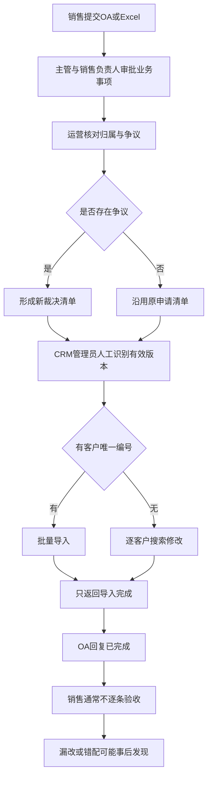

# 客户归属交接流程模拟诊断

> 性质：E5 纯模拟诊断，只验证方法和技术路线完整性。
>
> 不代表真实企业需求、系统能力、开发可行性或收益承诺；不写入正式总档案，不批准生产实施。

## 诊断结论

| 项目 | 结论 |
|---|---|
| 主要业务结论 | **补充调研后再判断** |
| 置信度 | 低至中，仅有角色扮演材料 |
| 技术成熟度 | **可进入离线影子验证** |
| 当前是否可生产开发 | 否；接口、权限、字段、批量上限和真实异常均未确认 |

模拟材料显示的核心矛盾不是“审批太慢”，而是申请、审批、执行和验收使用了不同的完成定义：OA 审批通过不代表 CRM 已执行，CRM 回复已完成也不代表每个客户都成功更新。

## 当前流程与风险

模拟识别出的主要风险：

1. Excel 缺少稳定客户编号时，必须依赖名称和人工判断。
2. OA 原附件与裁决清单可能同时有效展示，存在误用旧版本风险。
3. 业务审批、数据核验、CRM执行和员工验收没有独立状态。
4. CRM 批量处理缺少逐条成功、失败和遗漏回执。
5. 客户锁定、跨事业部权限和批量上限会形成部分完成。
6. 日志记录修改动作，但不关联 OA 单号，也不支持一键回滚。

## 责任分配

| 责任 | 建议承担者 | AI是否可替代 |
|---|---|---|
| 客户名单真实性与完整性确认 | 申请销售 | 否 |
| 交接事项与人员安排批准 | 销售负责人 | 否 |
| 归属争议裁决和有效版本确认 | 业务运营负责人 | 否 |
| CRM权限、锁定和执行异常确认 | CRM管理员 | 否 |
| 必填、重复、编号、版本和状态检查 | 确定性规则/工作流 | 可以自动执行 |
| 多材料摘要、异常线索解释和补证建议 | 有边界的AI能力 | 可以辅助，不做裁决 |
| 最终归属决定、高价值客户和跨事业部处理 | 有权管理角色 | 否 |

## 推荐的最小技术路线

不建议第一版使用能够自主修改客户归属的 Agent。该流程涉及客户资产、业绩和权限，核心判断应由规则、工作流和有权人员控制；AI只负责解释和发现线索。

| 组件 | 主要输入 | 主要输出 | 当前状态 |
|---|---|---|---|
| 名单预检 | OA字段、Excel | 缺失编号、重复、格式错误、版本号 | `可开发`：可先离线实现 |
| 客户主数据核对 | 客户编号、CRM导出 | 存在性、当前归属、锁定和权限提示 | `有条件`：需真实导出字段 |
| 有效版本控制 | 原清单、裁决清单 | 唯一有效版本、版本号和内容哈希 | `可开发`：可先离线验证 |
| 审批状态拆分 | 业务批准、数据核验、执行、验收 | 四个独立状态 | `有条件`：需确认OA配置能力 |
| CRM执行适配 | 有效清单 | 批量/API/RPA执行结果 | `阻塞`：接口、导入规则和权限未知 |
| 逐行结果回执 | 执行前后数据 | 成功、失败、跳过、待人工确认 | `有条件`：需可读的执行后数据 |
| AI辅助分析 | 证据与异常记录 | 风险摘要、疑似冲突、补证建议 | `可开发`：仅离线、不写回 |
| 审计与回滚包 | OA号、版本、变更前后值 | 可追溯记录和人工回滚清单 | `有条件`：真实日志字段未知 |

## 明确拒绝的路线

- 不让 Agent 自主裁决客户归属。
- 不让大模型直接生成并执行 CRM 修改指令。
- 不用客户名称模糊匹配结果直接更新主数据。
- 不把“导入完成”视为所有客户成功。
- 不在没有回执和回滚条件时做无人值守批量变更。

## 5天离线影子试点

| 天数 | 实际构建与验证 | 产物 |
|---|---|---|
| 第1天 | 固化模拟Excel字段、状态和20条正常/异常样本 | 样本集、字段字典、基线流程 |
| 第2天 | 开发离线名单预检：必填、编号、重复、版本和格式 | 逐行问题清单 |
| 第3天 | 使用脱敏CRM导出模拟存在性、归属、锁定和权限核对 | 核对结果表、人工确认队列 |
| 第4天 | 生成唯一执行清单和逐行结果回执，不连接生产CRM | 执行清单、回执、回滚清单 |
| 第5天 | 用正常、缺编号、重复、旧版本、锁定、越权场景复盘 | 试点报告、继续/暂停决定 |

### 通过标准

- 每一行客户都有唯一状态：通过、退回、阻断或人工确认。
- 旧版本不会进入执行清单。
- 缺少客户编号、重复客户、锁定和越权均被显式标记。
- 生成逐客户结果回执和人工回滚清单。
- 全程不写入生产CRM。

### 暂停标准

- 无法获得真实字段字典或脱敏CRM导出。
- 客户唯一编号不能稳定取得。
- 有权角色不同意责任和有效版本规则。
- 无法证明执行后可以读取逐客户结果。

## 还需要谁提供什么

| 责任角色 | 最小证据 |
|---|---|
| 销售申请人 | 真实OA字段、Excel模板和一次退回案例 |
| 销售负责人 | 审批责任边界和重点客户规则 |
| 业务运营负责人 | 争议裁决规则、有效版本和验收口径 |
| CRM管理员 | 导入模板、数量上限、权限、锁定、错误反馈和日志字段 |
| IT或系统负责人 | OA与CRM接口、可读写权限、测试环境和安全要求 |

## 客户沟通版

当前可以先做一轮不连接生产系统的名单预检和结果回执验证，重点验证客户编号完整性、旧版本拦截、重复客户、锁定客户和部分失败能否被可靠识别。生产集成、批量写入和自动化收益暂不承诺，待真实岗位和系统证据补齐后再决定。
