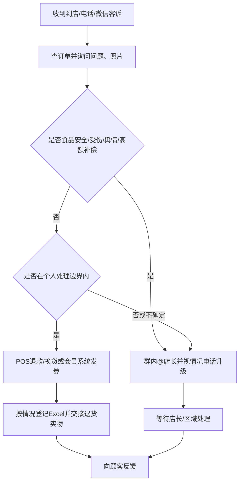

# 困难员工访谈与确认流程卡（模拟）

## 访谈场景

- 部门 / 岗位：华东一区 A17 门店，客服兼收银员；
- 本次工作：处理顾客商品客诉并完成退款、换货或升级；
- 访谈方式：Agent 每次只问一个问题；
- 员工特征：答案短、使用“处理一下”“看情况”“系统会有”等模糊表述。

## 自适应访谈记录

### 1. 选择具体工作

**Agent：** 请告诉我你的部门、岗位，以及这次想梳理的一项具体工作。优先选择经常重复、比较耗时、容易出错，或者需要多人协作的工作。

**员工：** 门店客服，主要就处理客诉。

**内部判断：** “处理客诉”范围过大，需要收窄到一个可重复输出。

**Agent追问：** 客诉里你最常重复处理、最后需要形成明确结果的是哪一类？

**员工：** 商品有问题，要退款或者赔一点。

### 2. 找到真实触发

**Agent：** 最近一次这类事情是顾客通过什么方式找到你，你最先收到了什么？

**员工：** 到店、电话、微信都有。一般就是跟我说商品有问题。

**内部判断：** 三种入口，信息结构不同；“跟我说”仍不可操作。

**Agent追问：** 你收到客诉后，第一步具体会问或记录哪些内容？

**员工：** 订单、商品、什么问题，有照片就发照片。

**Agent追问：** 这些内容记录在哪里？每一单都会记录吗？

**员工：** 简单的就直接退了，麻烦的我会写Excel，有时候也就在群里说。

### 3. 拆开“直接退了”

**Agent：** “直接退了”具体包含哪些操作，从确认订单开始按顺序说一下。

**员工：** 看小票或者会员手机号，在POS里找到订单，确认是我们店买的，然后选退款原因，退回去。

**Agent追问：** 哪些情况你能自己决定，哪些情况必须找店长？

**员工：** 小金额我能处理，大的找店长。

**Agent追问：** “小金额”的明确界限是多少？退款和额外补偿的权限一样吗？

**员工：** 退款好像200以内，补偿不太一样，50以内有时可以发券，但活动商品又不一定。

**内部判断：** 权限口径不确定，不能将数字写成正式规则；需要标记冲突并找制度或负责人。

### 4. 追出“看情况”

**Agent：** 当你说“看情况”时，你实际会看哪些信息来决定退款、换货还是升级？

**员工：** 看是不是质量问题、有没有用过、买了多久、顾客情绪，还有是不是食品。

**Agent追问：** 哪一类你无论金额多少都不会自己处理？

**员工：** 食品安全、顾客受伤、要发网上、要很多赔偿，这些肯定找店长，严重的店长找区域。

### 5. 还原交接与验收

**Agent：** 你把事情交给店长时，会发什么内容；你怎么知道店长已经接手？

**员工：** 群里@店长，把订单和照片发一下。店长回了就算接了。

**Agent追问：** 如果店长没有回复，或者换班后还没处理，你会怎么办？

**员工：** 我会再催，特别急就打电话。有时第二天别人问，我才发现群消息被刷走了。

### 6. 找到跨系统重复与缺失

**Agent：** 同一笔客诉通常需要在哪些地方重复录入？

**员工：** POS做退款，Excel登记客诉，群里说情况；发券还要去会员系统。总部问的时候又要找截图。

**Agent追问：** 这些地方有没有共同的客诉编号，可以确定它们是同一件事？

**员工：** 没有统一编号，基本靠订单号和时间找，有些没有订单号。

### 7. 获取真实异常

**Agent：** 说一个最近没有按正常流程结束的例子。

**员工：** 有个顾客说牛奶喝了不舒服，当时店长不在，我先把钱退了，在群里发了。后来总部问有没有批次和联系方式，我没记全，又打电话问顾客。

**Agent追问：** 这件事最后在哪里留下了完整结果，谁确认关闭？

**员工：** 好像Excel补了，但谁关的我不知道，区域经理后来在群里说处理好了。

### 8. 工作量与证据

**Agent：** 你估计一周处理多少笔，普通和复杂的一笔各需要多少主动操作时间？有没有记录可以验证？

**员工：** 一周十几笔吧，普通五分钟，麻烦的半小时以上。Excel应该能看到一部分，但直接退的没有都登记。

**内部判断：** 数量和时间只保留为E3估计；现有Excel不是完整总体。

### 9. 草稿确认

**Agent：** 我目前理解的是：客诉从到店、电话或微信进入；你先找订单并判断问题类型，普通退款可能直接在POS处理，复杂案件才进入Excel和群聊；食品安全、受伤、舆情或高额补偿需升级；POS、Excel、群聊和会员系统没有统一案件编号；店长以群回复表示接手，但没有稳定的关闭确认。哪一步不准确、遗漏或顺序不对？

**员工：** 基本对。但只要发券我一般都会登记，不是所有复杂的都登记；另外退货商品要放到售后区，交给值班人。

**Agent：** 我已补上发券登记和退货商品实物交接。请确认：这份卡是否正确描述了你实际做的这项工作？

**员工：** 是。

## 员工确认流程卡

| 项目 | 内容 |
|---|---|
| 项目代号 | SIM-RTL |
| 员工编号 | E-017（虚构） |
| 部门 / 岗位 | A17门店 / 客服兼收银员 |
| 本次工作 | 商品客诉受理到退款、换货、补偿或升级交接 |
| 触发 / 频率 | 到店、电话、企业微信；员工估计每周十几笔 |
| 结果使用者 | 顾客、店长、区域经理、总部客服、财务 |
| 确认状态 | 员工已确认 / v1 |

| 步骤 | 谁做 | 输入 | 实际操作 | 系统/材料 | 输出/去向 | 判断依据 | 异常怎么办 | 证据状态 |
|---|---|---|---|---|---|---|---|---|
| 1 | 客服 | 顾客陈述、订单/手机号、照片 | 查找订单，询问商品、问题、时间和诉求 | POS、微信、电话 | 初始信息 | 是否本店订单；无订单时靠商品和时间 | 找不到订单时继续问或找店长 | E3员工确认 |
| 2 | 客服 | 初始信息 | 判断普通退款、换货、补偿或升级 | 个人经验，正式规则待核 | 处理路线 | 质量、使用情况、购买时间、食品、顾客情绪 | 不确定时找店长 | E3员工确认 |
| 3 | 客服 | 普通案件 | POS退款/换货，或会员系统发券 | POS、会员系统 | 退款/券/换货结果 | 员工口述退款约200、券约50，但不确定 | 活动商品或超限找店长 | E3，权限数字未验证 |
| 4 | 客服 | 高风险或超权限案件 | 群内@店长，急件电话联系 | 企业微信群、电话 | 升级材料 | 食品安全、受伤、舆情、高额补偿 | 无回复则催办；消息可能被刷走 | E3员工确认 |
| 5 | 客服/值班人 | 退回商品 | 放入售后区并口头/群内交接 | 售后区、群聊 | 实物交接 | 是否需留样/退供不清楚 | 换班时可能遗漏 | E3员工补充确认 |
| 6 | 客服 | 处理结果 | 发券必登Excel；其他案件按情况登记；向顾客反馈 | Excel、群聊、POS | 分散记录和顾客答复 | 无统一案件编号 | 总部追查时靠订单号、时间和截图重找 | E3员工确认 |

## 工作负担

| 频率 | 数量 | 操作时间 | 等待 | 返工与影响 | 证据状态 |
|---|---|---|---|---|---|
| 每周 | 员工估计十几笔；Excel仅覆盖一部分 | 普通约5分钟，复杂30分钟以上 | 等店长或区域回复不稳定 | 补问顾客、找截图、换班遗漏、总部追查 | E3估计，需系统样本验证 |

## 已确认与待确认

- 员工确认：入口、基本处理动作、四套工具、无统一客诉编号、高风险升级、退货实物交接和群消息遗漏风险。
- 待确认：退款和补偿权限、食品安全材料要求、案件关闭人、Excel覆盖率、实际数量和耗时。
- 员工明确确认时间：模拟 2026-08-12。

> 本卡只还原该员工的实际陈述，不代表全企业流程，也不包含改造建议。

