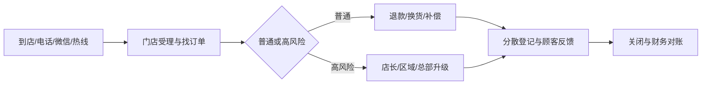
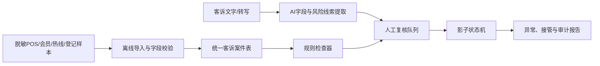

# 企业 AI 应用诊断：门店客诉退款与补偿（内部模拟版）

## 1. 结论

| 判断 | 结果 |
|---|---|
| 业务首要结论 | **先改造原业务流程** |
| 业务置信度 | **中**：跨系统分散和责任语义冲突有多角色与小样本支持，但总体发生量、漏登率和损失未验证 |
| 技术成熟度 | **可进入离线影子验证** |
| 生产集成成熟度 | **补齐系统条件后可设计集成** |

核心问题不是“缺少智能客服 Agent”，而是同一客诉在POS、会员系统、共享表、热线和群聊之间缺少稳定案件关联；补偿权限、正式接管和关闭定义也未统一。AI可以帮助理解非结构化客诉，但不能代替企业确定权限、责任和高风险处置规则。

## 2. 业务问题重述

- 目标结果：每笔客诉有稳定标识、必要字段、当前责任人、处理状态、证据链和明确关闭条件；
- 当前痛点：入口分散、登记覆盖未知、群聊承担责任转移、补偿权限口径冲突、高风险材料可能后补、关闭定义不统一；
- 当前不能证明：11笔确定漏登、实际损失、ROI、普遍超时或系统一定支持接口。

## 3. 证据与禁止结论

| 主题 | 当前能说什么 | 证据 |
|---|---|---|
| 登记 | SOP和店长要求全登记；员工称简单退款可能不登记；两个小样本存在无法直接匹配的记录 | C-R02/03/04/06，X-R01 |
| 补偿权限 | 正式材料与店长均要求额外补偿由店长批准；员工报告存在50元内自行发券的做法 | C-R09/10，X-R02 |
| 接管 | 员工把“收到”理解为接手，店长只理解为已读 | C-R13，X-R03 |
| 高风险 | SOP要求30分钟电话上报；员工个案显示材料和上报可能不完整 | C-R11/12，X-R04 |
| 关闭 | SOP要求记录；区域提出24小时目标；高风险样本closed_at为空且定义存在分歧 | C-R14/15，X-R05 |

继承证据包全部禁止结论，尤其不能把总部口述的11笔直接写成“漏登记”，不能把50元写成自动审批规则，也不能承诺24小时关闭。

## 4. 需求真实性

| 维度 | 判断 |
|---|---|
| 重复性 | 成立，但频率仅有员工估计和局部样本 |
| 风险 | 高风险客诉涉及食品、受伤、舆情和客户承诺，后果成立但发生率未知 |
| 流程稳定性 | 普通退款动作较稳定；补偿、接管、关闭和高风险例外不稳定 |
| 数据 | 有局部POS和登记表样本；跨系统标识与全量导出未知 |
| 负责人 | 门店、区域和总部均参与；缺唯一跨部门流程负责人 |
| 成功指标 | 可测登记覆盖、材料完整、接管确认、人工复核和异常接管；当前没有基线 |

因此需求具备诊断和试点价值，但第一步是统一业务状态和权限，而不是直接建设自主 Agent。

## 5. 能力责任边界

本节回答“某类判断和动作应由什么能力承担”，不是给企业员工分派开发任务。业务规则和系统组件的实施责任见本节后半部分。

| 层次 | 应承担的工作 | 第一阶段边界 |
|---|---|---|
| 业务流程 | 客诉范围、临时编号、补偿权限、正式接管动作、关闭定义和SLA例外 | 企业负责人批准 |
| 确定性规则 | 必填材料、200元退款阈值、额外补偿审批、高风险关键词/类型、超时提醒 | 规则负责人维护，冲突未解决前不自动决策 |
| 工作流 | 案件状态、责任人、等待、升级、退回、关闭和人工接管 | 核心主干 |
| AI工作流 | 从顾客文字/通话转写提取问题、商品、诉求和风险线索；草拟摘要 | 仅生成候选字段和证据片段，人工确认 |
| API/文件/RPA | 读取POS、会员、热线和共享表记录 | 接口未知，先文件影子 |
| RAG | 查询经批准的SOP和处理话术 | 只有在制度版本与维护负责人明确后才有条件采用 |
| 有界Agent | 根据状态动态选择查询或追问 | 首轮不采用；固定工作流足以验证 |
| 人工 | 补偿批准、高风险定级、对客承诺、最终关闭和规则变更 | 保留最终责任 |

### 企业组织决策责任

| 企业角色 | 必须确认或提供 | 不应转交给AI决定 |
|---|---|---|
| 业务总负责人 | 客诉范围、唯一流程负责人、状态口径、试点目标和验收门 | 是否上线以及规则冲突如何取舍 |
| 运营负责人 | 补偿权限、正式接管动作、关闭定义、普通案件SLA | 用模型猜测未定稿的业务口径 |
| 品控/客服负责人 | 高风险分类、上报路径、材料要求和人工复核标准 | 食品安全、受伤、舆情事件的最终定级 |
| 财务 | 退款、发券和其他补偿的授权与对账要求 | 资金动作的最终批准 |
| 企业IT/安全 | 数据授权、接口、账号、沙箱、部署、日志和保留期限 | 默认开放系统权限或生产写回 |

### 实施开发与验收责任

| 参与方 | 第一阶段责任 | 交付边界 |
|---|---|---|
| 改造方产品/实施人员 | 把确认后的规则、字段、状态和异常路径转为原型与验收用例 | 不替企业决定业务权限，不虚构接口 |
| 改造方技术团队或受托供应商 | 开发离线导入器、案件表、规则检查、AI提取、复核队列、状态机和审计日志 | 未经批准不接生产、不写回、不自动赔付 |
| 企业IT及原系统供应商 | 提供接口或导出证明、测试环境、权限和安全评审；联合验收连接器 | 接口未知时不得口头视为可集成 |
| 企业员工与管理者 | 提供授权样本，参与影子测试，核对流程和异常结果 | 不承担软件开发责任 |

### 上线后维护责任

生产实施前必须逐项指定姓名或岗位，不能只写“企业负责”或“改造方负责”：

- 业务规则负责人：维护权限、状态、SLA和高风险口径；
- 数据与接口负责人：维护导出/API、账号、字段变化和故障联系；
- AI质量负责人：维护抽取样本、误报漏报基线和复核阈值；
- 运行负责人：处理异常队列、人工接管、重放和审计；
- 供应商责任：写入合同或实施单，明确缺陷、变更、响应和退出交接。

### 被拒绝路线

- **自主客服Agent直接决定赔付：** 权限冲突未解决，且涉及客户承诺与资金。
- **只接大模型分析群聊：** 不能建立正式案件状态、责任转移和跨系统对账。
- **纯RPA串四个系统：** 系统接入条件未知，而且自动搬运不会解决规则冲突。
- **只做知识库问答：** 能解释SOP，不能证明实际执行和案件闭环。

## 6. 系统与接口发现卡

| 系统 | 当前已知 | 接入方式 | 数据与标识 | 状态 |
|---|---|---|---|---|
| POS | 有6行退款导出样本 | API/定时导出/沙箱未知 | `refund_id`、`order_id`、时间、金额 | 仅样本确认 |
| 会员系统 | 员工用于发券 | 权限、API、导出未知 | 券ID、审批人、客诉关联未知 | 仅口述 |
| 共享Excel | 有10行登记样本 | 文件方式可行；实际权限未知 | `complaint_ref``order_id`等 | 小样本确认 |
| 总部热线 | 口述有32笔转办 | API/导出未知 | 热线案件号与门店编号映射未知 | 仅口述 |
| 企业微信 | 用于@店长与截图 | 合规导出和机器人权限未知 | 消息ID、回复语义、案件关联未知 | 仅口述 |

接口可用性、认证、沙箱、数据分类、部署、日志和维护负责人均未知，因此生产连接器处于阻塞状态。

## 7. 条件式技术方案

以下组件由改造方技术团队或企业指定的实施供应商开发/配置，企业业务负责人确认规则与验收标准，企业IT提供接入条件。表中的“可开发”只表示可以制作离线原型，不代表人员、预算、合同或生产接入已经确定。

| 组件 | 主要输入/输出 | 可行性 | 事实条件和限制 |
|---|---|---|---|
| 离线导入器 | POS、登记、会员和热线脱敏文件 → 标准行 | 可开发 | 有授权样本即可；坏行隔离、文件版本化 |
| 统一案件表 | 来源记录 → `case_id`及跨系统引用 | 有条件 | 跨系统稳定标识未知；先用人工映射验证 |
| 规则检查器 | 金额、类型、材料、审批、时间 → 缺口/异常 | 有条件 | 补偿、接管和SLA规则需定稿 |
| AI字段提取器 | 顾客文字/转写 → 类型、诉求、风险线索、来源片段、置信度 | 可开发 | 不决定赔付，不把关键词直接当事实 |
| 人工复核队列 | AI候选和规则异常 → 确认/退回/升级 | 可开发 | 高风险和资金动作强制人工 |
| 影子状态机 | 已受理→待材料→待决定→待执行→待确认→关闭/异常 | 有条件 | 责任转移和关闭定义需负责人确认 |
| 审计日志 | 输入版本、规则版本、AI输出、人工修改、状态变化 | 可开发 | 确认保留期限并脱敏 |
| 生产连接器 | POS/会员/热线/企业微信读写 | 阻塞 | API/导出、权限、沙箱、安全均未知 |

### 非结构化客诉如何进入AI

AI只能处理经过授权、能够被系统读取的材料，不能自动听见没有留痕的电话或当面沟通。

| 原始渠道 | 可用输入方式 | 无材料时怎么办 | 第一阶段用途 |
|---|---|---|---|
| 在线文字/企业微信 | 授权接口、合规导出或员工转存的脱敏文本 | 人工填写结构化纪要 | 提取案件字段、诉求和风险线索 |
| 电话 | 授权录音转写、通话纪要或坐席表单 | 员工补录必要字段 | 提取候选字段并定位原文片段 |
| 当面 | 经同意的录音转写、现场表单或会后纪要 | 员工现场/会后补录 | 形成内部摘要和复核任务 |
| POS/会员/热线记录 | API、稳定导出或授权文件 | 人工观察表 | 关联订单、退款、发券和案件状态 |

AI字段提取器服务于内部案件结构化、风险提醒和人工复核，不等于自动客户回复。未来若增加辅助回复，仍需限定在经批准的话术和知识范围内；赔付、高风险定级和对客承诺继续由人工负责。

### 建议案件字段草案

`case_id`、`source_record_ids`、`store_id`、`order_id`、`received_at`、`channel`、`issue_type`、`risk_flags`、`requested_action`、`refund_amount`、`compensation_type`、`approval_required`、`approval_status`、`current_owner`、`handoff_accepted_at`、`customer_response_at`、`closed_at`、`closure_reason`、`evidence_refs`、`human_review_status`。

这些字段是试点契约，不代表现有系统已经具备。

### 接入条件分支

| 条件 | 路线 | 控制 |
|---|---|---|
| 官方API/Webhook可用 | 先只读同步，写回另行审批 | 最小权限、限流、重试、幂等、审计 |
| 只有稳定导出 | 每日批量文件影子处理 | 文件哈希、去重、坏行隔离、重放、人工对账 |
| 无接口但UI稳定且授权 | 必要节点用RPA只读 | 页面变更检测、截图、重试上限、人工接管 |
| 无系统访问 | 人工观察表+脱敏样本 | 不影响原流程，不宣称集成 |

## 8. 五天影子试点

| 天 | 构建与验证 | 产物 | 停止条件 |
|---|---|---|---|
| 1 | 选2家店各20笔脱敏样本；确认案件字段、人工基准和状态词典草案 | 样本清单、字段字典、规则冲突清单 | 无授权或无法建立任何记录关联 |
| 2 | 构建离线导入器和统一案件表；人工标注跨系统匹配 | 导入日志、匹配/未匹配清单 | 数据字段不足且无补证路径 |
| 3 | 构建规则检查和AI提取；对文本保留证据片段 | 缺件清单、AI/人工对照 | 高风险线索无来源仍被自动接受 |
| 4 | 演练普通退款、额外补偿、食品不适、店长未接管四条路径 | 状态变化、人工接管和异常日志 | 资金或高风险动作绕过人工 |
| 5 | 比较原记录与影子结果，评估接口分支、维护责任和下一阶段 | 误报漏报、覆盖基线、继续/调整/停止建议 | 业务负责人不确认权限和状态责任 |

### 验收门

- **通过：** 每笔样本都有可追溯案件；所有高风险与补偿动作进入人工；跨系统无法匹配被显式报告；四条异常路径可接管；无生产写回。
- **观察：** AI普通字段有误但复核能发现；规则仍有冲突但不影响影子展示；系统接口未确认。
- **停止：** 未授权数据、敏感内容越界、资金动作被自动执行、高风险漏报无法被复核发现、或案件无法恢复到原流程。

## 9. 下一决策门

1. 业务负责人统一补偿权限、接管动作、关闭定义与高风险SLA；
2. IT提供POS/会员/热线/表格的最小接口或导出证据；
3. 两家门店完成5天人工基线与影子对照；
4. 再决定是否进入API/文件/RPA集成验证；
5. 首轮不把自主Agent作为必要能力。
